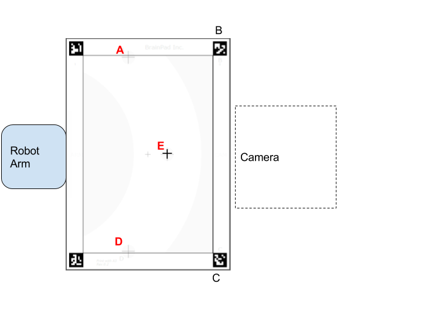
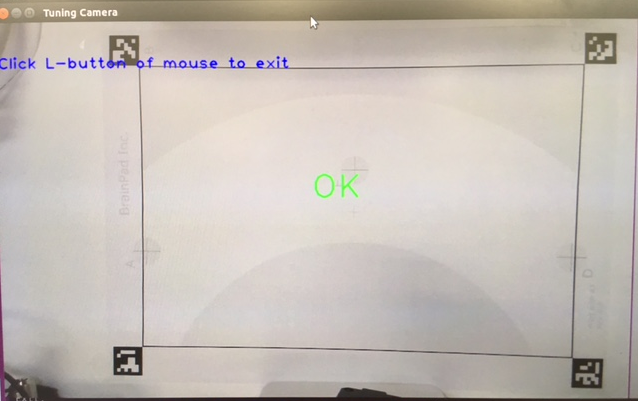

Instruction
=====

## Space Requirement
- More than 50cm x 55cm ( recommend 80cmｘ80cm )  space required.
- See [requirements.md](./requirements.md) for layouts.


## Hardware Components
- Robot Arm
  - [Dobot Magician](http://dobot.cc/store/buy-dobot-magician.html)
- Document camera
  - [Ipevo Ziggi-HD](https://www.amazon.com/dp/B01530XGMA)
  - [Ipevo Height Extension Stand](https://www.amazon.com/dp/B00CTIF2O0)
- [A3 marker sheet](./image/marker_paper.pdf)
  - for camera and robot arm to adjust their position
- Linux Box
  - [Intel NUC kit](https://www.amazon.com/dp/B01DG1SEES)
    - Core-i3 or i5 (included in Intel NUC kit)
    - HDMI or mini HDMI cable is needed accordingly.
  - 2 x [8GB Memory](https://www.amazon.com/dp/B00CQ35HBQ))
  - [SSD 250GB](https://www.amazon.com/dp/B0194MV5U8)（One of Sandisk’s long life (5 yrs) series is strongly recommended for price and stability）
- Tablet UI
  - Nexus 9 tablet
- See [requirements.md](./requirements.md) for the full list.

## Step1 : Place hardware components and Marker sheet
1. Print out [the marker sheet](./image/marker_paper.pdf) in A3 paper and stick it on the center. This sheet will be used during both setup and demo.
2. Set up the robot arm by following the manufacturer's manual.
 - Attach the suction cup on the arm.
 - In some cases, we experienced the robot's firmware beeing outdated. In such a case, DobotStudio is required to upgrade its firmware (See manuals).
3. Place the robot arm to attach the A3 paper on A-D side.
4. Plugin the power supply unit of the robot arm to AC outlet.
5. Place the camera (CDVU-06IP) as shown below. In this case, camera should built with joint extender CDVU-04IP-A1 Note: If you can't buy the extender in your region, any small box of with 27 - 32cm in height can be used instead.




## Step2 : Setup Linux Box (Controller PC)
- Build the linux ox by following the instructions from manufacturers. Install the memory and SSD accordingly.
- Connect the following components to the linux box.
  - A HDMI display, keyboard and mouse to the linux box.
  - The robot arm and the camera to linux box with USB cables.
  - Ethernet hub with LAN cable for network connectivity.
- Install Linux and softwares
  - See [linux box.md](./linux_box.md) for details.

#### Getting API credential.

This demo requires API credential for Google Cloud Platform.

- Create a new GCP project
- Enable the following APIs
  - Vision API (see also: https://cloud.google.com/vision/docs/quickstart)
  - Natural Language API (see also: https://cloud.google.com/natural-language/docs/getting-started)
  - CloudML API (see also: https://cloud.google.com/ml/docs/how-tos/getting-set-up)
- Create a service account key file
- See [this doc](https://cloud.google.com/vision/docs/common/auth#set_up_a_service_account) to create a service account key
    - Service account: Compute Engine default service account
    - Key type: JSON
  - Save the JSON on ~/FindYourCandy/setup/script directory.
- Execute the following command (replace the path_to_your_own_credential_file with the actual JSON file path).

```
$ export GOOGLE_APPLICATION_CREDENTIALS="path_to_your_own_credential_file"
```

## Step3: Camera Calibation
The following instructions illustrates how to adjust the camera position.

1. Boot up the linux box and login to the desktop.
2. Execute the following command. It will show the camera view in the desktop window.

```
> cd ./FindYourCandy/setup/script
> python2 camera_tune.py
```

3. If you cannot see 'OK' sign in the window, tweak the camera or its extension and have whole image of A3 paper.
   - You may also try to get better focus by switching the AF slide on the camera head between S and C.
   - In most cases, keeping the slide to S and pressing `[・] (focus)` button a few times does good in our environment.
4. You may click on left mouse button to exit this software.



## Step4: Robot Arm Caribration
(* Read the safety manuals of your Robot Arm , befor proceeding this section.)
1. Execute the following command to start robot arm caribration.

```
> python2 robot_tune.py
```

  - If you get "dobot offline" message, please try upgrading the dobot firmware

2. Hit `Enter` key to initialize the robot arm.
3. Push the `release` button (which has symbol of `unlock` ) while you holding the robot arm by the other hand. Please be aware when the button is pressed, the robot arm looses friction and will start falling instantly. To avoid damaging your robot or desk, you should always assist robot arm when you press the `release` button.
4. Slowly land the arm edge to the center of `Maker A`. (still pressing the button.)
5. Hit `Enter` key.
6. Repeat above 3,4 and 5 for Marker D and E.
7. The program ends automatically.


## Step5: Tablet
1. Bootup Nexus9 and login with a google account for demo.
2. Update firmware.
3. Connect the [Ethernet Adapter for Chromecast](https://store.google.com/product/ethernet_adapter_for_chromecast)('GL0402') to Nexus9’s OTG connector. This is a hack to provide power and ether connection through USB cable when wifi is not proper to use.
4. Follow the “Set up Chromecast” on the [google support page](
https://support.google.com/chromecast/answer/2998456?hl=en)
\(there is instruction for Android 4.1 and higher\).
(* If you have a trouble with voice recognition of Nexus9, consider for external microphone.)

## Step6: Demo Application

#### Configure and run demo
  - See [README.md](../robot-arm) for robot-arm
  - See [README.md](../webapp) for webapp
