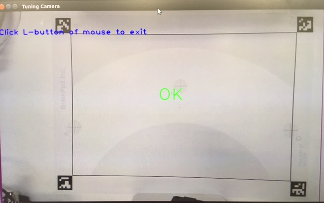
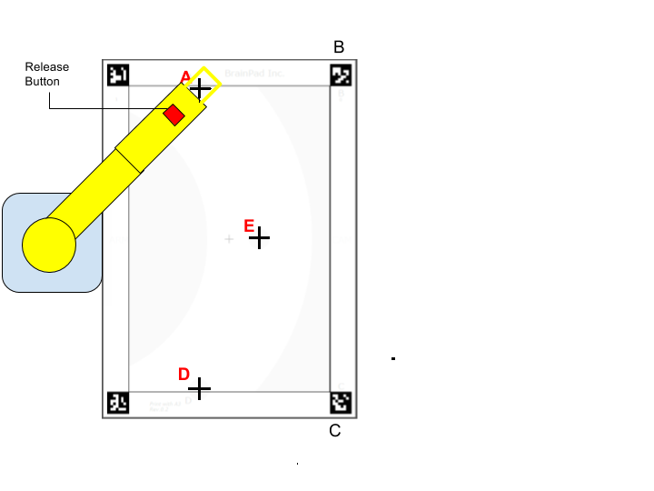

setup
=====

### Space Requirement
- More than 500mm x 550mm ( recommend 80cmｘ80cm )  space required.

### Hardware Components
- Robot Arm
  - [Dobot Magician](http://dobot.cc/store/buy-dobot-magician.html)
- Document camera
  - [Ipevo Ziggi-HD](https://www.amazon.com/dp/B01530XGMA)
  - [Ipevo Height Extension Stand](https://www.amazon.com/dp/B00CTIF2O0)
- [A3 marker sheet](./image/marker_paper.pdf)
  - for camera and robot arm to adjust their position
- Linux Box
  - [Intel NUC kit](https://www.amazon.com/dp/B01DG1SEES)
    - Core-i3 or i5 (included in Intel NUC kit)
    - HDMI or mini HDMI cable is needed accordingly.
  - [Memory 4GB](https://www.amazon.com/dp/B00CQ35GYE)
  - Memory 16GB (2 x [Memory 8GB](https://www.amazon.com/dp/B00CQ35HBQ))
  - [SSD 250GB](https://www.amazon.com/dp/B0194MV5U8)（One of Sandisk’s long life (5 yrs) series is strongly recommended for price and stability. not samsung or other）

### Step1 : Place hardware components and Marker sheet
1. Print out this marker sheet in A3 paper and stick it on the center
(This sheet will be used during both setup and demo.)
2. Build the robot arm by following manuals.
3. Place the robot arm to attach the A3 paper on A-D side.
4. Plugin the power supply unit of the robot arm to AC outlet.
5. Place the camera(CDVU-06IP) as shown below. In this case, camera should built with joint extender, CDVU-04IP-A1.
Note: due to unavailability of CDVU-06IP extender unit.

### Step2 : Setup Linux box as controller PC.
- Build your linux box by following direction of each manufacture.
  - You might need to mount ssd and memory inside the linux box unless they are already built in.
- Connect both the robot arm and the camera to linux box.
  - The suction cup should be attached on arm end.
- Connect to the internet using LAN cable.
- During setup you need  a LCD display, a keyboard and a mouse. please prepare.
- Install linux and softwares
  - Ubuntu 16.04.1 Server 64bit (you may also try Desktop 64bit)
    - See [linux box.md](./linux_box.md)

### Step3: Camera Calibation

The following instructions illustrates how to adjust the camera position.

1. Boot up linux box and login the desktop.
2. Execute 'script/camera_tune.py' that are included in DEMO software. And see the camera view in the window.
3. If you cannot see OK sign in the window, tweak the camera or its extension and have whole image of A3 paper.
  - You may also try to get better focus by switching between S and C on the camera.
4. You may click on left mouse button to exit this software.

### Step4: Robot Arm Caribration

1. Execute 'script/robot_tune.py' to start tuning the coordinate of arm.
2. To avoid damaging the robot arm during this process, hold the arm first by your hand. And then push the release button (which is marked ‘unlock’ ) on the other hand. After releasing the robot arm, it may fall instantly.
3. You slowly land the arm edge to the center of “Maker A”.
4. Hit “Enter” key.
5. Repeat above 2 and 3 for Marker D and E.
6. The program ends automatically.

### Step5: Tablet
1. Bootup Nexus9 and login with a google account for demo.
2. Update firmware
3. Connect GL0402 (Ultra Adapter) to Nexus9’s OTG connector.
ChromeCast Ultra
4. Follow the “Set up Chromecast” on the [google support page](
https://support.google.com/chromecast/answer/2998456?hl=en)
\(there is instruction for Android 4.1 and higher\).

### Step6: Demo Application
- Run demo Application
  - See [application_setup.md](./application_setup.md)
